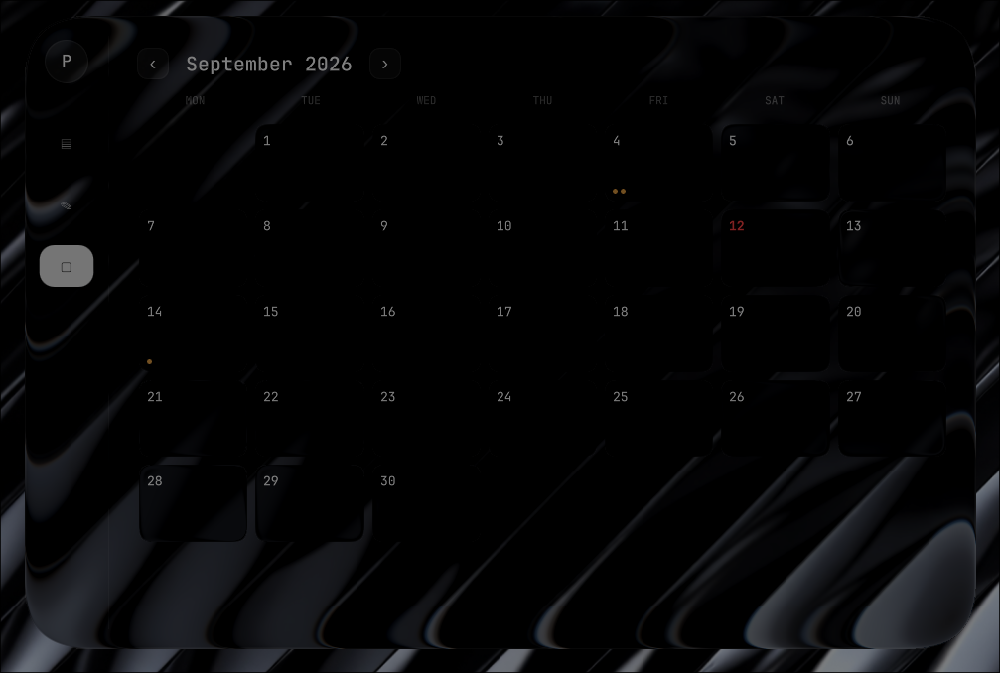
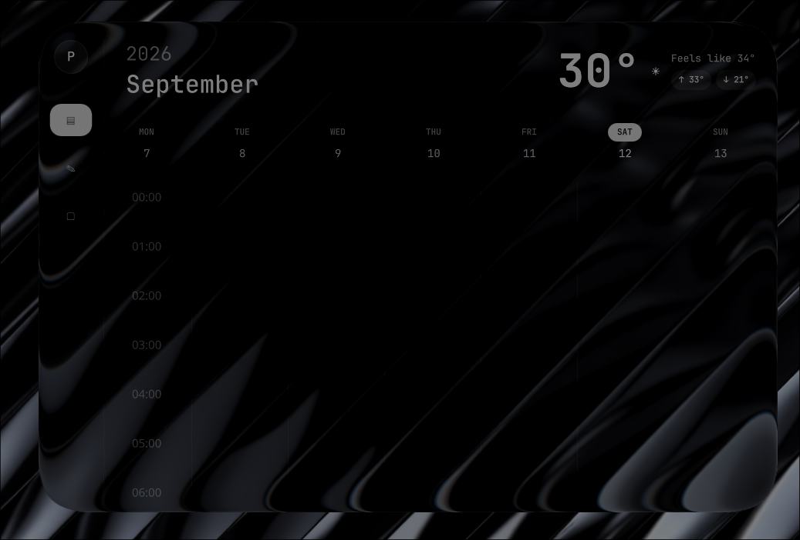
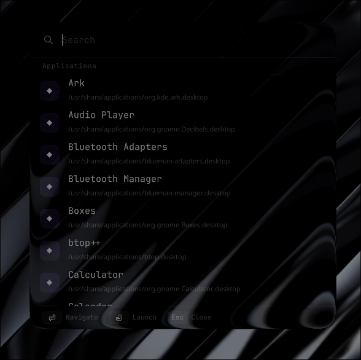

# LinuxGlass — Liquid Glass for Hyprland

> **Linux deserves better.**
>
> When I look at what Apple has built with Liquid Glass — the depth, the refraction, the way light bends through it — and then look at what we have on Linux, I feel genuinely frustrated. Not because Linux developers aren't talented. They are. They're arguably more technically capable than anyone at Apple. But for some reason, beauty isn't treated as something worth building here.
>
> I built LinuxGlass to change that. Not to copy Apple — to challenge Linux developers to do what they always do: take something good and make it better. I want the day to come where Apple designers are getting inspired by *us*. That day starts with someone building the first thing. This is that first thing.
>
> Take this. Build something incredible with it. Make Apple look at Linux and feel the pressure.

LinuxGlass is a Hyprland compositor plugin that brings true Liquid Glass rendering to your Linux desktop. Frosted blur, Snell's-law edge refraction, chromatic aberration, specular highlights, CSS-style inner and outer shadows — all rendered in real time inside the compositor itself, on every window and layer surface.

## Screenshots







---

It is a heavily extended fork of the original [hyprglass](https://github.com/hyprnux/hyprglass) by Hyprnux. The original plugin provided the foundational architecture for capturing the background framebuffer — that backdrop sampling approach is the only thing carried forward from the upstream. Everything else — the per-region API, the native QML plugin, the socket protocol, the shadow system, the animation engine — was designed and built from scratch.

**Target:** Hyprland 0.55.3 · Fedora Linux · Wayland

---

## What's New vs. Upstream

The upstream plugin applies a single glass effect to an entire window. LinuxGlass goes far beyond that:

| Feature | Upstream | LinuxGlass |
|---|---|---|
| Whole-window glass | ✅ | ✅ |
| Per-region independent glass | ❌ | ✅ |
| Native QML component (`GlassItem`) | ❌ | ✅ |
| Persistent socket protocol | ❌ | ✅ |
| CSS-style inner shadow | ❌ | ✅ |
| CSS-style outer shadow | ❌ | ✅ |
| True optical outer shadow (refracted through glass) | ❌ | ✅ |
| Shadow offset (x/y) | ❌ | ✅ |
| `layerBelow` compositing | ❌ | ✅ |
| Animated region interpolation on compositor clock | ❌ | ✅ |
| `animateTo()` QML method for smooth glass animation | ❌ | ✅ |
| Ghost-region cleanup on client disconnect | ❌ | ✅ |

---

## Two Plugins, One System

LinuxGlass ships as two complementary plugins:

### 1. `hyprglass.so` — The Compositor Plugin
The C++ Hyprland plugin that does the actual rendering. It hooks into Hyprland's render pipeline and draws glass effects. It exposes two interfaces:

- **Lua API** — for whole-window glass and layer surfaces, configured via `hyprctl eval`
- **Unix Socket API** — a persistent socket server that QML/Electron/GTK4 apps connect to for per-region native glass

### 2. `libHyprglassPlugin.so` — The Native QML Plugin
A C++ Qt Quick plugin that exposes `GlassItem` as a native QML component. Drop it into any QML layout and it automatically tracks its own position and size (including ancestor chain movements) and sends real-time region updates to the compositor over the socket. No subprocess spawning, no IPC lag, no per-frame polling.

---

## Installation

### Build the compositor plugin

```bash
git clone https://github.com/pashupatastrab-sudo/hyprglass
cd hyprglass
make clean && make
hyprctl plugin load $(pwd)/hyprglass.so
```

> ⚠️ Always use `make clean && make` — never `make` alone after editing headers. The Makefile's dependency tracking does not catch header-only changes and will produce a corrupted binary that crashes Hyprland.

To persist across reboots, add to your Hyprland config:

```
plugin = /path/to/hyprglass.so
```

### Build the QML plugin

```bash
git clone https://github.com/pashupatastrab-sudo/hyprglass-qml-plugin
cd hyprglass-qml-plugin/Hyprglass
cmake -B build -DCMAKE_BUILD_TYPE=Release
cmake --build build
sudo cmake --install build
```

This installs to `/usr/lib64/qt6/qml/Hyprglass/`. After this, any QML app can `import Hyprglass`.

> ⚠️ Always run `sudo cmake --install build` after rebuilding. The local build output and the system-installed copy are two separate things. Forgetting the install step means your app imports a stale plugin with an old wire protocol, causing silent failures or compositor crashes.

---

## Configuration

### Basic Lua config (whole-window glass)

```lua
if hl.plugin.hyprglass then
    local hg = hl.plugin.hyprglass

    hg.config({
        default_theme = "dark",
        default_preset = "clear",
        tint_color = 0x8899aa22,
        brightness = 0.9,
        dark = { brightness = 0.82 },
        light = { adaptive_boost = 0.5 },
        layers = { enabled = 1 },
    })

    -- Layer surfaces
    hg.layer("waybar", { preset = "subtle", mask_threshold = 0.05 })
    hg.layer("quickshell:bezel", { preset = "ui", mask_threshold = 0.3 })

    -- Presets
    hg.preset("clear", {
        glass_opacity = 0.8,
        blur_strength = 1.5,
        dark = { brightness = 0.7 },
        light = { brightness = 1.2 },
    })
end
```

### Global settings

| Option | Type | Default | Description |
|---|---|---|---|
| `enabled` | bool | true | Enable/disable globally |
| `default_theme` | string | `dark` | `dark` or `light` |
| `default_preset` | string | `default` | Default preset name |

### Visual settings (overridable per theme and preset)

| Option | Type | Default | Description |
|---|---|---|---|
| `blur_strength` | float | 2.0 | Blur radius scale |
| `blur_iterations` | int | 3 | Gaussian blur passes (1–5) |
| `refraction_strength` | float | 0.6 | Edge refraction intensity |
| `chromatic_aberration` | float | 0.5 | Spectral dispersion at edges |
| `fresnel_strength` | float | 0.6 | Edge glow intensity |
| `specular_strength` | float | 0.8 | Specular highlight brightness |
| `glass_opacity` | float | 1.0 | Overall glass opacity |
| `edge_thickness` | float | 0.06 | Bezel width, fraction of smallest dimension |
| `tint_color` | color | `0x8899aa22` | RRGGBBAA hex. Alpha = tint strength |
| `lens_distortion` | float | 0.5 | Center dome magnification |
| `brightness` | float | 0.82 (dark) / 1.12 (light) | Brightness multiplier |
| `contrast` | float | 0.90 / 0.92 | Contrast around midpoint |
| `saturation` | float | 0.80 / 0.85 | Desaturation (0 = grayscale) |
| `vibrancy` | float | 0.15 / 0.12 | Selective saturation boost |
| `adaptive_dim` | float | 0.4 (dark) | Dims bright areas behind glass |
| `adaptive_boost` | float | 0.4 (light) | Boosts dark areas behind glass |

---

## Per-Region Glass API

This is the main feature that separates LinuxGlass from everything else. Instead of one glass effect per window, you can define many independent glass regions within a single window — each with its own position, size, preset, and shadow.

### Lua API (via `hyprctl eval`)

```lua
-- Register a namespace (one per app/window)
hyprglass.setregions("myapp", {
    { id = 1, x = 10, y = 10, w = 200, h = 100, preset = "clear" },
    { id = 2, x = 10, y = 120, w = 200, h = 100, preset = "subtle" },
})

-- Animate regions on the compositor's own render clock (smoother than polling setregions)
hyprglass.animateregions("myapp", {
    { id = 1, x = 50, y = 50, w = 200, h = 100, duration = 300 },
})

-- Force a redraw
hyprglass.refresh("myapp")

-- Set a scissor clip region (for scroll containers)
hyprglass.setregionclip("myapp", { x = 0, y = 0, w = 400, h = 300 })

-- Clean up all regions for a namespace
hyprglass.clearnamespace("myapp")
```

### Socket Protocol (for native integrations)

The compositor plugin listens on a Unix socket at:
```
$XDG_RUNTIME_DIR/hyprglass/<HYPRLAND_INSTANCE_SIGNATURE>.sock
```

This is how the native QML plugin communicates. The protocol is binary and toolkit-agnostic — you can connect from QML, Electron (Node native addon), GTK4, or any language that can open a Unix socket.

---

## Native QML Integration (`GlassItem`)

The recommended way to use per-region glass in QML apps. No subprocess spawning, no polling, no IPC lag.

### Installation check

```bash
ls /usr/lib64/qt6/qml/Hyprglass/
```

### Basic usage

```qml
import Hyprglass

Rectangle {
    id: myCard
    width: 300
    height: 200

    GlassItem {
        anchors.fill: parent
        preset: "clear"
        layerBelow: false
    }
}
```

`GlassItem` automatically tracks its own position and size — including when any ancestor in the QML tree moves or resizes. You don't need to do anything. Just drop it in and it works.

### Properties

| Property | Type | Default | Description |
|---|---|---|---|
| `preset` | string | `""` | Preset name from your Lua config |
| `layerBelow` | bool | false | Composite this region below sibling items in the same window |
| `innerShadow` | string | `""` | CSS box-shadow syntax for inner shadow |
| `outerShadow` | string | `""` | CSS box-shadow syntax for outer shadow |

### Shadows (CSS syntax)

Shadows use a CSS-like string syntax. Both inner and outer shadows support offset, blur, spread, and color:

```qml
GlassItem {
    anchors.fill: parent
    preset: "clear"

    // Inner shadow: offset-x offset-y blur spread color
    innerShadow: "0px 4px 8px 2px rgba(0,0,0,0.4)"

    // Outer shadow: same syntax, plus optional "true" for optical mode
    outerShadow: "0px 8px 24px 4px rgba(0,0,0,0.6)"

    // True outer shadow — shadow is refracted through the glass
    // where it overlaps the glass body (same optical pipeline as real backdrop)
    outerShadow: "4px 4px 16px 2px rgba(0,0,0,0.5) true"
}
```

**True outer shadow** is a LinuxGlass-exclusive feature. When enabled, the portion of the outer shadow that falls beneath the glass body is treated as real backdrop content — it receives the same refraction, chromatic aberration, dome distortion, and frost treatment that the actual background behind the glass gets. It genuinely looks like light bending through a shadow.

### Animated glass (`animateTo`)

For smooth animated glass movement, use `animateTo()` instead of directly setting position properties. This fires the compositor-side animation at the same time as the QML animation so they stay in sync:

```qml
GlassItem {
    id: glassBox
    width: 200
    height: 100

    function moveToPosition(nx, ny) {
        glassBox.animateTo({ x: nx, y: ny, width: 200, height: 100 }, 300)
    }
}
```

---

## Per-Window Overrides (Window Rules)

```lua
-- Disable glass on a specific app
hl.window_rule({ match = { class = "mpv" }, tag = "+hyprglass_disabled" })

-- Force light theme on Firefox
hl.window_rule({ match = { class = "firefox" }, tag = "+hyprglass_theme_light" })

-- Apply a specific preset to a terminal
hl.window_rule({ match = { class = "kitty" }, tag = "+hyprglass_preset_subtle" })
```

Or on the fly:
```bash
hyprctl dispatch tagwindow +hyprglass_disabled
hyprctl dispatch tagwindow +hyprglass_theme_dark
hyprctl dispatch tagwindow +hyprglass_preset_subtle
```

---

## Built-in Presets

| Preset | Description |
|---|---|
| `high_contrast` | Strong tinting, good contrast, lower blur, stronger refraction |
| `subtle` | Minimal effect — light blur, reduced refraction and highlights |
| `clear` | Near-transparent glass plate — minimal tint, clean edges |
| `glass` | Solid glass block with heavy chromatic aberration |

---

## How It Works

The rendering pipeline per window/region:

1. **Background sampling** — The framebuffer behind the window is captured with padding beyond the window boundary
2. **Gaussian blur** — Multi-pass two-pass (horizontal + vertical) for the frosted look
3. **Glass height field** — SDF-based height profile: 1.0 deep inside, smooth S-curve to 0.0 at edge
4. **Edge refraction** — Height field gradient drives UV displacement using Snell's law — content bleeds in from beyond the window boundary at edges
5. **Chromatic aberration** — R, G, B sampled with slightly different refraction scales; blue bends more
6. **Center dome lens** — Subtle barrel magnification in the interior
7. **Frost treatment** — Luminance-dependent brightness, contrast, desaturation, vibrancy
8. **Color tint overlay** — Configurable RRGGBBAA tint
9. **Fresnel edge glow** — Schlick-based approximation at glass edges
10. **Specular highlight + inner shadow** — Top-biased highlight and bottom-rim depth shadow
11. **CSS shadows** — Inner shadow (SDF-based, offset-aware) and outer shadow (drawn in inflated margin region, with optional true-optical mode)

For layer surfaces, the plugin hooks `renderLayer` and uses a temp FBO redirect: background is sampled and blurred, then Hyprland's surface rendering is redirected into a transparent temporary framebuffer to capture exact alpha. A post-surface pass composites the glass effect and surface content back together.

---

## Known Issues

- Ghost glass regions persist if a QML app is killed with `pkill -9` instead of graceful shutdown. Workaround: unload and reload the plugin (`hyprctl plugin unload` then `hyprctl plugin load`), or use `hyprglass.clearnamespace()` from Lua
- Layer surface glass hooks into a private Hyprland internal (`renderLayer`) — may break on Hyprland updates that change this function's signature
- Hyprland's log file receives no hyprglass-tagged output (cause unknown); debug logging goes to `/tmp/glass_debug.log` instead
- True outer shadow currently applies frost treatment only — full optical parity (refraction, chromatic aberration, dome distortion, blur) is in progress

---

## Roadmap

- [ ] Full optical parity for true outer shadow (refraction + chromatic aberration + dome distortion)
- [ ] Multiple comma-separated CSS-style shadows
- [ ] Electron integration (Node native addon connecting to the socket)
- [ ] GTK4 direct integration
- [ ] Real-time configuration GUI (sliders for blur, opacity, shadow, distortion, vibrancy)

---

## Credits

The backdrop buffer sampling architecture — the approach of capturing the framebuffer behind a window with padding and redirecting it through a temporary FBO — originates from [hyprglass](https://github.com/hyprnux/hyprglass) by **Hyprnux**. That foundation made everything else possible. Everything built on top of it — the per-region system, the socket protocol, the QML plugin, the shadow engine, the animation system — was designed and implemented independently.

---

## License

MIT — see [LICENSE](LICENSE).

---

*For every Linux developer who looked at Apple's UI and thought: we can do that. Build something.*
